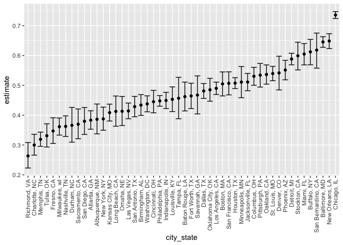
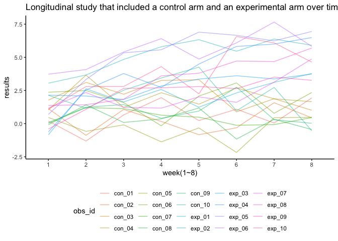

p8105\_hw5\_fc2691
================
FC
11/15/2021

## Problem 1

``` r
library(readr)
library(tidyverse)
library(knitr)
library(rvest)
library(broom)
library(dplyr)
library(fs)

url = "https://raw.githubusercontent.com/washingtonpost/data-homicides/master/homicide-data.csv"

homi_data <- read_csv(url(url), na = c("", "Unknown"))
```

There are total 12 variables and 52179 observations in this raw file. It
describes each incidents in details with the time, location, the
offenders’ personal information and the arrest results.

``` r
# Clean data of homicides
homi_data_raw <-
  homi_data %>% 
  # mutate(city_state = str_c(city, ", ", state))
  mutate(city_state = paste(city, state, sep = ", ")) %>% 
  relocate(city_state) %>% 
  mutate(
    resolution = case_when(
      disposition == "Closed without arrest" ~ "unsolved", 
      disposition == "Open/No arrest" ~ "unsolved", 
      disposition == "Closed by arrest" ~ "solved"
  )) %>% 
  filter(city_state != "Tulsa, AL")
# Summarize total number of homicides in cities. 
homi_city_count <- 
  homi_data_raw %>% 
  count(city_state) %>% 
  rename(homi_count = n)

# Count number of unsolved homicides. 
homi_unsol_count <- 
  homi_data_raw %>% 
  filter(resolution == "unsolved") %>%
  count(city_state) %>% 
  rename(unsol_count = n)
# Joint table of total counts of homicides and unsolved homicides. 
homi_joint_count = left_join(homi_city_count, homi_unsol_count, by = "city_state")
kable(homi_joint_count[1:10,])
```

| city\_state     | homi\_count | unsol\_count |
|:----------------|------------:|-------------:|
| Albuquerque, NM |         378 |          146 |
| Atlanta, GA     |         973 |          373 |
| Baltimore, MD   |        2827 |         1825 |
| Baton Rouge, LA |         424 |          196 |
| Birmingham, AL  |         800 |          347 |
| Boston, MA      |         614 |          310 |
| Buffalo, NY     |         521 |          319 |
| Charlotte, NC   |         687 |          206 |
| Chicago, IL     |        5535 |         4073 |
| Cincinnati, OH  |         694 |          309 |

``` r
# Focus on Baltimore, MD
baltimore_df <- 
  homi_data_raw %>% 
  filter(city_state == "Baltimore, MD") %>% 
  summarize(unsolved_n = sum(resolution == "unsolved"), 
            total_n = n()) 

# prop.test("Baltimore, MD")
baltimore_test <- 
  prop.test(baltimore_df$unsolved_n, baltimore_df$total_n)
# prop.test(baltimore_df %>% pull(unsolved_n), baltimore_df %>% pull(total_n))

baltimore_test %>% 
  broom::tidy()
```

    ## # A tibble: 1 × 8
    ##   estimate statistic  p.value parameter conf.low conf.high method    alternative
    ##      <dbl>     <dbl>    <dbl>     <int>    <dbl>     <dbl> <chr>     <chr>      
    ## 1    0.646      239. 6.46e-54         1    0.628     0.663 1-sample… two.sided

``` r
# Write function-test across several cities
prop_test_function <- function(city_df) {
  city_summary <-
    city_df %>% 
    summarize(
      unsolved_n = sum(resolution == "unsolved"), 
      total_n = n()
    ) 
  city_test <- 
    prop.test(
      city_summary$unsolved_n, 
      city_summary$total_n)
  
  return(city_test)
}

balti_df <- 
  homi_data_raw %>% 
  filter(city_state == "Baltimore, MD") 
prop_test_function(balti_df)
```

    ## 
    ##  1-sample proportions test with continuity correction
    ## 
    ## data:  city_summary$unsolved_n out of city_summary$total_n, null probability 0.5
    ## X-squared = 239.01, df = 1, p-value < 2.2e-16
    ## alternative hypothesis: true p is not equal to 0.5
    ## 95 percent confidence interval:
    ##  0.6275625 0.6631599
    ## sample estimates:
    ##         p 
    ## 0.6455607

``` r
homi_data_raw %>% 
  filter(city_state == "Albuquerque, NM") %>% 
  prop_test_function()
```

    ## 
    ##  1-sample proportions test with continuity correction
    ## 
    ## data:  city_summary$unsolved_n out of city_summary$total_n, null probability 0.5
    ## X-squared = 19.114, df = 1, p-value = 1.232e-05
    ## alternative hypothesis: true p is not equal to 0.5
    ## 95 percent confidence interval:
    ##  0.3372604 0.4375766
    ## sample estimates:
    ##         p 
    ## 0.3862434

``` r
# Iterate across all cities
results_df <-
  homi_data_raw %>% 
  nest(data = uid:resolution) %>% 
  mutate(
    city_test = map(data, prop_test_function),
    tidy_results = map(city_test, broom::tidy)
  ) %>% 
  dplyr::select(city_state, tidy_results) %>%
  unnest(tidy_results) %>% 
  dplyr::select(city_state, estimate, starts_with("conf"))

# Code above learned from OH using function. 
# # Run prop.test for all cities
# city_df <- 
#   homi_data_raw %>% 
#   group_by(city_state) %>% 
#   summarize(unsolved_n = sum(resolution == "unsolved"), 
#             total_n = n()) 
# 
# city_test <- city_df %>%
#   mutate(
#     city_test = purrr::map2(unsolved_n, total_n, prop.test),
#     city_test = purrr::map(city_test, tidy)
#   ) %>%
#   unnest(city_test) %>% 
#   dplyr::select(city_state, estimate, conf.low, conf.high)


# Create plots for each city
results_df %>% 
  mutate(city_state = fct_reorder(city_state, estimate)) %>% 
  ggplot(aes(x = city_state, y = estimate)) + 
  geom_point() +
  geom_errorbar(aes(ymin = conf.low, ymax = conf.high)) + 
  theme(axis.text.x = element_text(angle = 90, vjust = 0.5, hjust = 1))
```

<!-- -->

## Problem 2

``` r
# # Data frame containing all files names.
file_list <-
  tibble(files = list.files("./data")) 

# Map data
file_df_raw <- 
  file_list %>% 
  mutate(
    file_path = paste("./data", files, sep = '/'),
    file_content = map(file_path, read_csv)
  ) %>%
  unnest(file_content)

# Clean data
file_df_clean <-
  file_df_raw %>% 
  janitor::clean_names() %>%
  select(-file_path) %>% 
  mutate(files = sub(".csv", "", files)) %>%
  pivot_longer(
    week_1:week_8,
    names_to = "week_id", 
    values_to = "data", 
    names_prefix = "week_") %>% 
  rename(obs_id = files)
file_df_clean
```

    ## # A tibble: 160 × 3
    ##    obs_id week_id  data
    ##    <chr>  <chr>   <dbl>
    ##  1 con_01 1        0.2 
    ##  2 con_01 2       -1.31
    ##  3 con_01 3        0.66
    ##  4 con_01 4        1.96
    ##  5 con_01 5        0.23
    ##  6 con_01 6        1.09
    ##  7 con_01 7        0.05
    ##  8 con_01 8        1.94
    ##  9 con_02 1        1.13
    ## 10 con_02 2       -0.88
    ## # … with 150 more rows

``` r
# Make a spahetti plot. 
obs_vis_plot = 
  file_df_clean %>% 
  ggplot(aes(x = week_id, y = data, color = obs_id, group = obs_id)) + 
    geom_line(alpha = 0.5) + 
    theme_classic() + 
    theme(legend.position = "bottom") + 
    labs(
     title = "Longitudinal study that included a control arm and an experimental arm over time", 
     x = "week(1~8)", 
     y = "results", 
  ) 
obs_vis_plot 
```

<!-- -->

From the spaghetti plot, we could observed the results collected from
the experimental arm had on average higher data compared to the control
arm according to each individual. For experimental group, the data
seemed in a slightly increasing trending through week1 to week 8 while
control group looked almost stable.

## Problem 3

``` r
library(tidyverse)

set.seed(10)

iris_with_missing = iris %>% 
  map_df(~replace(.x, sample(1:150, 20), NA)) %>%
  mutate(Species = as.character(Species))

# Build missing function
fill_in_missing <- function(vector) {
  if (is.numeric(vector)) {
    vector = ifelse(is.na(vector), mean(vector, na.rm = TRUE), vector)
  }
  if (is.character(vector)) {
    vector = ifelse(is.na(vector), "virginica", vector)
  }
  else {
    vector = ifelse(is.na(vector), "ERROR", vector)
  }
}
iris_no_missing <- map_dfr(iris_with_missing, fill_in_missing)
iris_no_missing
```

    ## # A tibble: 150 × 5
    ##    Sepal.Length Sepal.Width Petal.Length Petal.Width Species
    ##           <dbl>       <dbl>        <dbl>       <dbl> <chr>  
    ##  1         5.1          3.5         1.4         0.2  setosa 
    ##  2         4.9          3           1.4         0.2  setosa 
    ##  3         4.7          3.2         1.3         0.2  setosa 
    ##  4         4.6          3.1         1.5         1.19 setosa 
    ##  5         5            3.6         1.4         0.2  setosa 
    ##  6         5.4          3.9         1.7         0.4  setosa 
    ##  7         5.82         3.4         1.4         0.3  setosa 
    ##  8         5            3.4         1.5         0.2  setosa 
    ##  9         4.4          2.9         1.4         0.2  setosa 
    ## 10         4.9          3.1         3.77        0.1  setosa 
    ## # … with 140 more rows
